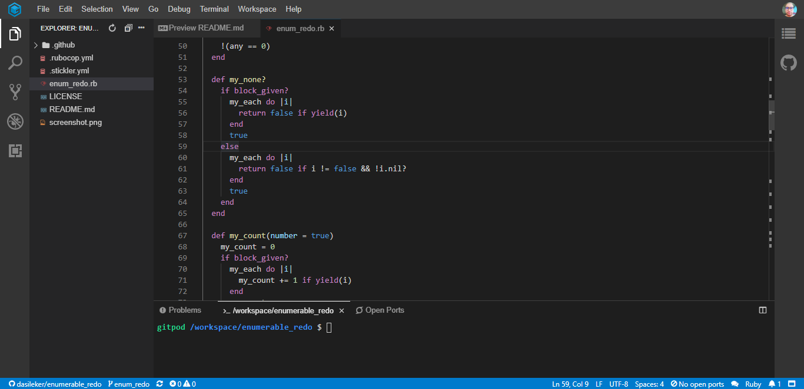

# enum-methods-redo
Add your new methods onto the existing Enumerable module
> The aim of this project is to create an Enumerable module that gets mixed into the Array and Hash classes (among others) and provides you with lots of handy iterator methods. To prove that there's no magic to it, you're going to rebuild those methods.

## Project screenshot

## Project specifications
1. Create a script file to house your methods and run it in IRB to test them later.
2. Add your new methods onto the existing Enumerable module.  Ruby makes this easy for you because any class or module can be added to without trouble ... just do something like:

~~~ruby
  module Enumerable
    def my_each
      # your code here
    end
  end
~~~

3. Create `#my_each`, a method that is identical to `#each` but (obviously) does not use `#each`.  You'll need to remember the `yield` statement.  Make sure it returns the same thing as `#each` as well.
4. Create `#my_each_with_index` in the same way.
5. Create `#my_select` in the same way, though you may use `#my_each` in your definition (but not `#each`).
6. Create `#my_all?` (continue as above)
7. Create `#my_any?`
8. Create `#my_none?`
9. Create `#my_count`
10. Create `#my_map`
11. Create `#my_inject`
12. Test your `#my_inject` by creating a method called `#multiply_els` which multiplies all the elements of the array together by using `#my_inject`, e.g. `multiply_els([2,4,5]) #=> 40`
13. Modify your `#my_map` method to take a proc instead.
14. Modify your `#my_map` method to take either a proc or a block. It won't be necessary to apply both a proc and a block in the same `#my_map` call since you could get the same effect by chaining together one `#my_map` call with the block and one with the proc. This approach is also clearer, since the user doesn't have to remember whether the proc or block will be run first. So if both a proc and a block are given, only execute the proc.
      
## 🔨 Built in

- Ruby
- Rubocop
- Stickler-CI

## 🚀 Our Project

Our project can be found at https://c2aceaa3-eb5a-42f2-92ec-dc911dd4e841.ws-eu01.gitpod.io/
## Live Demo

[Live Demo Link](https://eb148b80-1a42-4a85-a23b-1c0d91d2294f.ws-eu01.gitpod.io/#/workspace/enumerable_redo)

## To run the project in local

- clone the repository from here [repo link](git@github.com:dasileker/enumerable_redo.git)

- Enter to GIT bash and hit: git clone git@github.com:dasileker/enumerable_redo.git

- Open vscode and you have it now

## 👨🏽‍💻 👨🏿‍💻 Creators

👤 **Author1**

- Github: [@Zerradi](https://github.com/dasileker)

## 🤝 Contributing

Contributions, issues and feature requests are welcome!

Feel free to check the [issues page](issues/).

## Show your support

Give a ⭐️ if you like this project!

## 📝 License

This project is [MIT](lic.url) licensed.